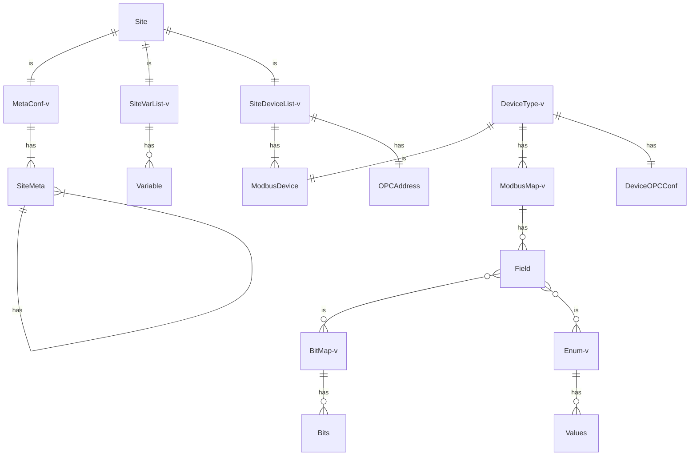

```mermaid
erDiagram
    Site ||--|| MetaConf-v : is

    MetaConf-v ||--|{ SiteMeta : has
    SiteMeta ||--|{ SiteMeta : has
    
    Site ||--|| SiteVarList-v : is
    SiteVarList-v ||--o{ Variable : has

    Site ||--|| SiteDeviceList-v : is
    SiteDeviceList-v ||--|{ ModbusDevice : has
    SiteDeviceList-v ||--|| OPCAddress : has

    DeviceType-v ||--|| ModbusDevice : is
    DeviceType-v ||--|{ ModbusMap-v : has
    DeviceType-v ||--|| DeviceOPCConf : has
    
    ModbusMap-v ||--o{ Field : has
    Field }o--o{ BitMap-v : is
    BitMap-v ||--o{ Bits : has
    Field }o--o{ Enum-v : is
    Enum-v ||--o{ Values : has
```